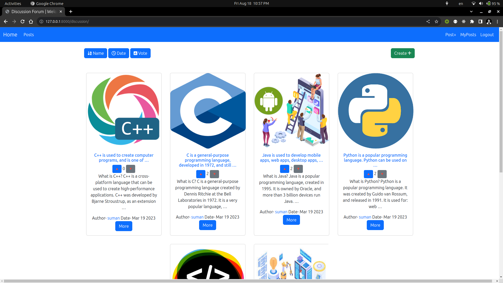

# DiscussionForum

Welcome to DiscussionForum, a platform for open discussions and sharing knowledge on various topics. This project is designed to foster community engagement, collaboration, and learning.


## Table of Contents

- [DiscussionForum](#discussionforum)
  - [Table of Contents](#table-of-contents)
  - [Introduction](#introduction)
  - [Features](#features)
  - [Usage](#usage)
  - [Setup](#setup)
  - [Project Structure](#project-structure)
  - [Contributing](#contributing)
  - [Acknowledgments](#acknowledgments)
  - [Home Page](#home-page)

## Introduction

DiscussionForum is an online platform that allows users to create, participate in, and moderate discussions on diverse subjects. Whether you're seeking answers, sharing expertise, or engaging in thoughtful conversations, this forum provides the space to connect with others who share your interests.

## Features

- **User Authentication:** Users can sign up, log in, and log out.
- **Discussion Threads:** Registered users can create posts and participate in discussion threads.
- **Vote:** Users can upvote/downvote on discussion threads.
- **Sorting:** User can sort posts by date, votes and alphabetical.
- **Moderation:** Admins can moderate discussions and manage user accounts.

## Usage
- User Registration and Login:
  - Register for an account on the website.
  - Log in using your credentials.
  
- Explore and Create Discussions:
  - Browse recent posts and discussions.
  - Create new posts on various topics.

- User-Specific Actions:
    - View posts created by yourself.
    - Filter discussions to see posts by specific users.
  
- Sort the Discussions:
    - Sort discussions based on date, vote count, or alphabetical order.

- Contact Form:
    - Use the contact form to send messages to administrators.

## Setup

1. **Clone the Repository:**

   ```bash
   git clone https://github.com/moti9/DiscussionForum.git
   cd DiscussionForum
    ```
2. Install `pipenv` if not already installed:
    ```bash 
    $ pip install pipenv 
    ```

3. Create a virtual environment and install dependencies:
    ```bash
    $ pipenv install
    ```

4. Activate the virtual environment:
    ```bash
    $ pipenv shell
    ```

5. Create a MySQL database named `discussionforum` and update the database settings in `settings.py`.

6. Run database migrations:
    ```bash
    $ python manage.py makemigrations
    $ python manage.py migrate
    ```

7. Create a superuser for admin access:
    ```bash
    $ python manage.py createsuperuser
    ```

9. Access the website at --- `http://localhost:8000`

## Project Structure

The project is structured as follows:

<code>

DiscussionForum/\
│\
├── accounts/\
│ ├── migrations/\
│ ├── admin.py\
│ ├── apps.py\
│ ├── forms.py\
│ ├── models.py\
│ ├── test.py\
│ ├── urls.py\
│ └── views.py\
|\
├── discussion/\
│ ├── migrations/\
│ ├── admin.py\
│ ├── apps.py\
│ ├── forms.py\
│ ├── models.py\
│ ├── test.py\
│ ├── urls.py\
│ └── views.py\
│\
├── forum/\
│ ├── asgi.py\
│ ├── settings.py\
│ ├── urls.py\
│ ├── views.py\
│ ├── wsgi.py\
│ └── ...\
│\
├── media/\
├── ReadmeImg/\
│ ├── ...\
├── templates/\
│ ├── accounts\
│ | ├── login.html\
│ | └── signup.html\
│ |\
│ ├── discussion\
│ | ├── create.html\
│ | ├── detail.html\
│ | ├── home.html\
│ | └── userposts.html\
│ |\
│ ├── partials\
│ | ├── footer.html\
│ | └── navbar.html\
| |\
│ ├── base.html\
│ └── home.html\
|\
├── db.sqlite3\
├── manage.py\
├── Pipfile\
├── Pipfile.lock\
└── ...\

</code>

## Contributing
Contributions are welcome! If you find issues or have suggestions for improvement, feel free to fork the repository and submit pull requests.

## Acknowledgments
We extend our gratitude to all contributors who have helped shape and improve this DiscussionForum project.

## Home Page

